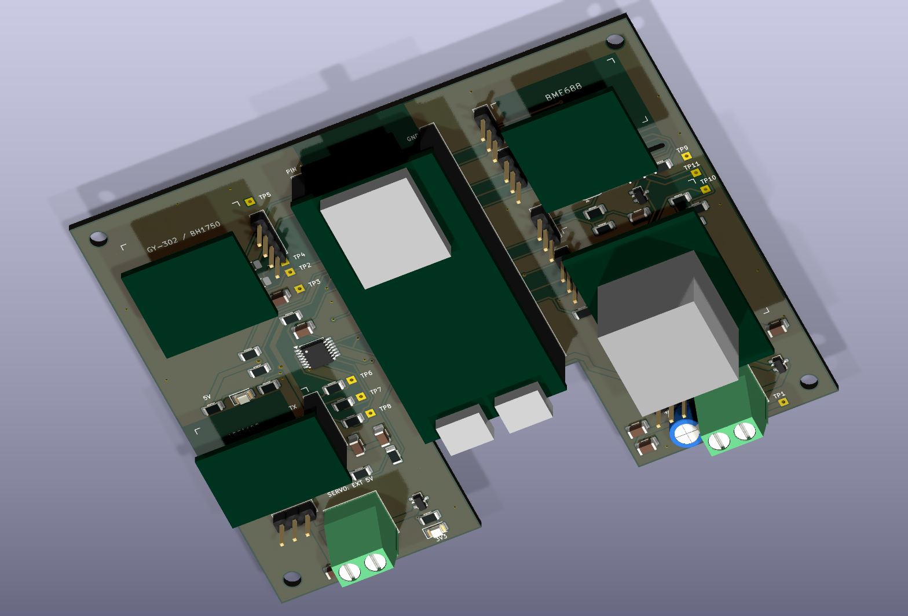

# S3-ENVIRONMENT

ESP32-S3 多传感器环境监测项目：可插拔 PCB 底板、ESP32 固件，以及 PHP / PostgreSQL / WebSocket 网站。

底板用 PCB 替代面包板与杜邦线。ESP32-S3、GY-302、BME688、LD2410C 和 MQ 均使用现成模块，通过排母插入，便于维修和更换。

## 当前状态

| 部分 | 版本 / 状态 |
|---|---|
| PCB | R1.1，KiCad 9，110×90 mm，2 层 FR4，1.6 mm，1 oz，4 个 M3 安装孔 |
| PCB 检查 | ERC、DRC、未连接网络、原理图 / PCB 一致性均为 0 问题；自动电气和天线铜区检查通过 |
| PCB 制造文件 | 已提供 Gerber / 钻孔；**MECHANICAL_DIMENSION_PENDING，尚未标记 PRODUCTION VERIFIED** |
| 网络固件 | `carrier-network-1.0.2`，16MB Flash / 8MB OPI PSRAM，两种 USB 构建版本 |
| 实物验证 | 2026-10-05 经 CH343 / COM4 烧录；Flash / PSRAM、重启自动联网、WSS 上传、PostgreSQL 入库和网页立即采样已通过 |
| 网站 | 已部署至 [s.xuanknow.cn](https://s.xuanknow.cn)，Linux / 宝塔 / Nginx / PHP 8.5 / PostgreSQL，SSL 由宝塔管理 |
| 传感器 | 载板尚未到货；杜邦线接法下 BH1750 / BME688 读取、上传、入库和网页立即采样已通过；MQ 未连接、雷达未供电，完整四传感器测试尚未通过 |

开发板排距 **25.40 mm**、针距 **2.54 mm**，每侧 22Pin。端部偏移、各模块本体尺寸及 USB 插头包络仍需实物确认。打板前按 [硬件说明](hardware/README.md) 核对 [1:1 校验 PDF](hardware/fabrication/ESP32_FOOTPRINT_1_TO_1_CHECK.pdf)，不要把暂定制造文件当作已完成机械验证的版本。



## 仓库目录

```text
S3-ENVIRONMENT/
├── server/                  PHP 网站、API、数据库、WebSocket、邮件 / 清理任务
│   ├── public/              Nginx 网站根目录；CSS / JS / Chart.js
│   ├── src/                 登录、数据校验、实时服务、邮件任务
│   ├── bin/                 初始化、迁移、改密码、地址同步、后台服务
│   ├── database/schema.sql
│   ├── composer.json / composer.lock / vendor/
│   └── .env.example         配置模板；不含真实运行密钥
├── firmware/                Wi-Fi / WSS 主固件，PlatformIO 工程与预编译文件
├── hardware/                完整 KiCad R1.1 工程、封装、3D、BOM、Gerber、审查
│   └── firmware_test/       无网络的传感器串口测试程序
├── deployment/              Nginx / Supervisor / Caddy / Docker / 备份模板
├── docs/                    软件说明、协议、部署记录与实物烧录记录
├── tools/eda/               嘉立创 EDA CLI / MCP 与 Run API Gateway 辅助工具
├── tests/                   隔离数据库的软件集成 / 浏览器测试
├── test_results/            已执行的软件、编译与实物验证结果
├── screenshots/             软件联调与实物截图；模拟数据截图明确标注
├── compose.yaml / compose.production.yaml
├── start_windows.ps1 / stop_windows.ps1
└── SHA256SUMS.txt            仓库内容校验清单
```

## 从哪里开始

- **打开和核对电路板**：[hardware/README.md](hardware/README.md)、[设计摘要](hardware/Design_Summary.md)、[BOM](hardware/fabrication/BOM.csv)、[Excel BOM](hardware/fabrication/BOM_R1_1.xlsx)。用 KiCad 9 打开 `hardware/esp32_sensor_carrier.kicad_pro`。
- **部署网站**：[软件完整说明](docs/software.md)、[实际 Linux / 宝塔部署记录](docs/deployment/s_xuanknow_cn/README.md)。支持 Nginx 直接部署，Docker 是可选方式。
- **烧录 / 配网**：[软件说明](docs/software.md)、[实物烧录记录](docs/device_flash/ESP32S3_COM4/README.md)。常用 USB 转串口版本是 `yd_uart`。
- **用杜邦线测试**：[接线图和步骤](docs/dupont_test/README.md)，包括 MQ 必需保护电路；GPIO 按丝印数字识别。
- **查看通信格式**：[WebSocket 协议](docs/PROTOCOL.md)。
- **维护硬件**：[参数化与检查脚本](hardware/scripts/README.md)。重建布局脚本会产生未布线板，修改尺寸后需要重新布线和导出制造文件。

本仓库保留 Composer 锁文件和 PHP 依赖，以便直接部署；依赖更新通过 Composer 执行。第三方来源及许可证见 [资料说明](docs/SOURCES.md) 和各依赖目录。

## 网站功能

网站使用访问密码登录，可记住登录；支持历史表格、曲线、CSV 导出和设备实时状态。ESP32 正常每 **300 秒**上传一次，断线自动重试，上电自动连接。网页可以请求立即采样，设备完成新的传感器测量后返回记录。

PostgreSQL 默认保留最近 **60 天**，可在网页配置。网页还可设置 SMTP、收件邮箱与烟雾报警策略。SMTP 授权码加密保存；MQ 默认禁用，确认硬件供电、预热和输出极性后再启用。1.0.2 在 MQ 禁用时上传空值，网页显示“未启用”，避免悬空引脚读数被误认为 MQ 测量；旧历史记录保留。

## GPIO 与接口

| 功能 | GPIO | 连接 |
|---|---:|---|
| I2C SDA | 8 | BH1750 / BME688 共用 |
| I2C SCL | 9 | BH1750 / BME688 共用 |
| Radar RX | 17 | LD2410C TX → ESP RX |
| Radar TX | 18 | ESP TX → LD2410C RX |
| Radar OUT | 16 | LD2410C OUT |
| MQ ADC | 4 | AO 经 R1.1 分压、滤波及断电保护 |
| MQ DO | 5 | DO 经 Q1 反相保护，默认 GPIO5 HIGH 表示报警 |
| 普通扩展 | 6、7、10、11 | 3.3V GPIO |
| Servo PWM | 12 | 舵机电源使用独立输入 |

接口针序以 [interface_pinout.csv](hardware/fabrication/interface_pinout.csv) 和方形 Pin1 焊盘为准，尤其注意 R1.1 已修正 GY-302 与 MQ 的顶视安装针序。

BH1750 默认 `0x23`，可改为 `0x5C`；BME688 默认 `0x76`，可改为 `0x77`。MQ AO 分压为 6.8k / 7.5k，GPIO 节点另有 100k 负载和 100nF；固件按这些 R1.1 参数换算。LD2410C 使用 256000 / 8N1 UART。

## Linux / Nginx 部署要点

1. 准备 PHP 8.3+，启用 `pdo_pgsql`、`mbstring`、`sodium`、`openssl`，并创建 PostgreSQL 数据库。
2. 在 `server/` 执行 `composer install --no-dev --prefer-dist --optimize-autoloader`，按 [软件说明](docs/software.md) 初始化 `server/.env`。
3. 设置数据库连接、`APP_URL=https://你的域名`、`WS_PUBLIC_URL=wss://你的域名/ws`、`COOKIE_SECURE=1` 和 `WS_BIND=127.0.0.1`。
4. Nginx 网站根目录指向 **`server/public`**，`/ws` 反代至 `127.0.0.1:8081`；参考 `deployment/nginx.conf.example`。
5. 执行 `php server/bin/migrate.php`，通过 Supervisor 启动唯一的 `server/bin/websocket.php` 与 `server/bin/worker.php`。
6. 进入网页创建设备，把设备专属令牌和 2.4GHz Wi-Fi 信息填写到 ESP32 配网页面。

现有宝塔站点目录直接放置的是 `server/` 的内容，网站运行目录为 `/www/wwwroot/s.xuanknow.cn/public`；克隆本仓库后则是仓库内的 `server/public`。按实际目录调整 Nginx、Supervisor 和 `open_basedir`。

修改网站密码：`php server/bin/password.php`；修改公开地址：`php server/bin/set-public-url.php https://你的域名`。操作后重启后台进程。两项操作均保留设备令牌。

## 编译和烧录固件

在仓库根目录执行：

```sh
python -m pip install platformio
python -m platformio run --project-dir firmware -e yd_uart
python -m platformio run --project-dir firmware -e yd_uart -t upload --upload-port COM4
python -m platformio device monitor --port COM4 --baud 115200
```

Linux 将 `COM4` 改成实际串口，例如 `/dev/ttyUSB0`。原生 USB CDC 版本使用 `yd_native_usb`，与 CH343 调试串口版本分别提供构建产物。

源码和预编译固件不包含实际 Wi-Fi 密码或设备令牌。首次烧录后从串口查看临时配网 AP，打开 `http://192.168.4.1` 配置；已配置设备会自动连接。输入 `CONFIG` 或开机后长按 BOOT 5 秒可重新配置；`STATUS` 可查看连接和传感器诊断；`I2C_SCAN` 扫描地址，`SENSOR_RETRY` 重新初始化两块 I2C 模块，`REBOOT` 重启。

## 配置与验证记录

真实 `.env`、网站密码、设备令牌、SMTP 授权码、SSH 私钥、NVS 配网镜像、数据库与原 Flash 备份均未提交。需要为新的部署生成自己的密钥和设备令牌。实物记录中的 Wi-Fi 名称也已脱敏。

BH1750 / BME688 最新实测读数、I2C 地址及网页入库验证见 [physical_i2c_1.0.2.json](test_results/physical_i2c_1.0.2.json) 和 [实测页面截图](screenshots/physical_i2c_20261005.png)。

1.0.2 修正接线前的实物烧录、I2C 扫描、MQ 空值入库与立即采样验证见 [physical_bringup_1.0.2.json](test_results/physical_bringup_1.0.2.json)。MQ 显示回归检查：`node tests/mq_display.cjs`；MQ 遥测契约检查：`php tests/telemetry_mq.php`。

1.0.1 的历史物理网络验证见 [physical_website.json](test_results/physical_website.json) 和 [烧录启动检查](test_results/physical_flash.json)。`tests/` 的软件测试使用隔离的 `*_test` 数据库，包含清空测试表的操作；不会默认执行，也不应配置为真实监测数据库。

LD2410C、MQ 及真实烟雾邮件告警仍待实物验证；不能由两块 I2C 传感器通过就认定全部模块通过。硬件的 **MECHANICAL VERIFICATION REQUIRED** 状态保留在全部制造说明中。
